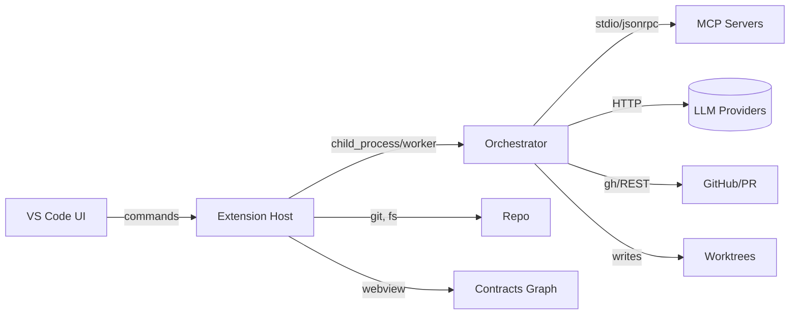

# VS Code Service Extension Design — Multi‑Agent Worktrees Orchestrator

A VS Code extension that turns your repo into a multi‑agent build floor using **Git worktrees**, **task‑scoped prompts**, and an **orchestrator** that schedules agents, enforces gates, and learns from outcomes.

---

## 1) Goals & Non‑Goals

**Goals**

- One‑click spawn of per‑task **worktrees/branches** and agent lifecycles (Refine → Design → Plan → Implement → Handoff).
- In‑repo artifacts for transparency: `task.md`, `plan.md`, `design/*.mmd`, `links.yaml`, `active_thoughts.md`, `signals.jsonl`.
- **Inter‑agent comms** via contracts and dependency graph; orchestrator relays change signals.
- **Tool/LLM selection** per task with genome configs; record outcomes for selection pressure.
- Tight **QA gates** (tests, lint, contract checks) before PR.

**Non‑Goals (v1)**

- Replacing full CI/CD or code owners; we call out to them.
- Hosting LLMs; we call external providers or MCP servers.

---

## 2) User Experience (UX)

### View Container: “Zippy Orchestrator”

- **Tasks** (TreeView): `backlog/`, `active/`, `in‑review/`. Right‑click → *Create Worktree*, *Run Lifecycle*, *Open Plan*, *Open PR*.
- **Worktrees** (TreeView): list of active worktrees with branch, phase, health. Right‑click → *Open*, *Kill Agent*, *QA Now*.
- **Agents** (TreeView): running agents with genome, model, tools, loop stats; start/stop.
- **Contracts Graph** (Webview): Mermaid graph of `needs/provides`; click node to open contract or task.
- **Telemetry** (Webview): sparkline of win rate, cycle time, PR bounces, coverage deltas.

### Commands (Palette)

- `Zippy: Initialize Project` – seeds folders, settings, schemas.
- `Zippy: Create Worktree from Task` – picks YAML in `/tasks/backlog/` → branch `agent/<id>`.
- `Zippy: Run Lifecycle` – drives A→E phases for selected task.
- `Zippy: Open Contracts Graph`
- `Zippy: QA Current Worktree`
- `Zippy: Open PR` (uses GH CLI or REST)
- `Zippy: Switch Agent Genome`
- `Zippy: View Agent Logs`

Keyboard: `Ctrl/Cmd+Shift+9` toggles the Orchestrator view.

---

## 3) Repository Conventions (recap)

```
/contracts/
/context/
/design/
/tasks/{backlog,active}/
/ors/                 # orchestrator helpers (optional)
/agent_kits/
/telemetry/
/tests/
.worktrees/<task>/    # per‑task branch checkout
  active_thoughts.md
  task.md
  plan.md
  design/
  impl/
  links.yaml
  signals.jsonl
```

---

## 4) Architecture



**Extension Kind**: `workspace` (runs in Node extension host).

**Processes**

- **Extension Host**: registers commands, views, status bar; manages secret storage & configuration; spawns orchestrator service.
- **Orchestrator Service** (Node child process or worker thread): runs state machines per task; calls tools, MCP, LLMs; writes artifacts & signals.

---

## 5) Data Model

### Task Spec YAML

```yaml
id: auth-session-rotation
component: auth-service
goal: "Rotate session keys every 12h with zero-downtime reissue."
acceptance:
  - "Existing sessions valid until grace window expires"
  - "New sessions signed with fresh key"
deps:
  provides: [session-key-rotation-v1]
  needs: [keystore-v2, user-auth.contract.md]
constraints:
  languages: [ts, go]
phase_policy:
  tools_allowed:
    design: [mermaid, openapi, mcp:code-search]
    impl: [git, unit-test, mcp:lsp, mcp:refactor]
```

### Agent “Genome”

```yaml
model: gpt-5x
tools: [mcp:lsp, mcp:code-search, unit-test]
prompts:
  refine: V3
  design: V2
  impl: V5
hyper:
  chain_depth: 2
  self_critique: true
  temperature: 0.3
```

### Signals (JSONL)

```json
{"t":"2025-08-16T17:02:01Z","event":"dep_needed","needs":"keystore-v2"}
{"t":"2025-08-16T17:09:12Z","event":"ready_for_pr","branch":"agent/auth-session-rotation"}
```

---

## 6) Extension Contributions (package.json)

```json
{
  "name": "zippy-orchestrator",
  "displayName": "Zippy Orchestrator: Multi‑Agent Worktrees",
  "publisher": "gozippy",
  "version": "0.1.0",
  "engines": { "vscode": ">=1.92.0" },
  "categories": ["Other"],
  "main": "dist/extension.js",
  "activationEvents": [
    "onStartupFinished",
    "onCommand:zippy.initProject",
    "onView:zippy.tasks",
    "workspaceContains:tasks/backlog"
  ],
  "contributes": {
    "commands": [
      { "command": "zippy.initProject", "title": "Zippy: Initialize Project" },
      { "command": "zippy.createWorktree", "title": "Zippy: Create Worktree from Task" },
      { "command": "zippy.runLifecycle", "title": "Zippy: Run Lifecycle" },
      { "command": "zippy.openContractsGraph", "title": "Zippy: Open Contracts Graph" },
      { "command": "zippy.qaNow", "title": "Zippy: QA Current Worktree" },
      { "command": "zippy.openPR", "title": "Zippy: Open Pull Request" },
      { "command": "zippy.switchGenome", "title": "Zippy: Switch Agent Genome" },
      { "command": "zippy.viewAgentLogs", "title": "Zippy: View Agent Logs" }
    ],
    "viewsContainers": {
      "activitybar": [{ "id": "zippy", "title": "Zippy", "icon": "media/zippy.svg" }]
    },
    "views": {
      "zippy": [
        { "id": "zippy.tasks", "name": "Tasks" },
        { "id": "zippy.worktrees", "name": "Worktrees" },
        { "id": "zippy.agents", "name": "Agents" },
        { "id": "zippy.contracts", "name": "Contracts Graph", "type": "webview" },
        { "id": "zippy.telemetry", "name": "Telemetry", "type": "webview" }
      ]
    },
    "configuration": {
      "title": "Zippy Orchestrator",
      "properties": {
        "zippy.llm.defaultModel": { "type": "string", "default": "gpt-5x" },
        "zippy.llm.providers": { "type": "array", "items": { "type": "object" } },
        "zippy.mcp.endpoints": { "type": "array", "items": { "type": "string" } },
        "zippy.git.useBuiltInApi": { "type": "boolean", "default": false },
        "zippy.github.useGhCli": { "type": "boolean", "default": true },
        "zippy.paths.contracts": { "type": "string", "default": "contracts" },
        "zippy.telemetry.enabled": { "type": "boolean", "default": true }
      }
    },
    "problemMatchers": [],
    "keybindings": [
      { "command": "zippy.toggleView", "key": "ctrl+shift+9" }
    ]
  },
  "dependencies": {
    "execa": "^8.0.1",
    "zod": "^3.23.8",
    "yaml": "^2.5.0"
  }
}
```

---

## 7) Extension Host (TypeScript) — skeleton

`src/extension.ts`

```ts
import * as vscode from 'vscode';
import { createWorktree, listWorktrees, openPR } from './gitWorktrees';
import { Orchestrator } from './orchestrator';
import { TasksView, WorktreesView, AgentsView } from './views';

let orch: Orchestrator;

export async function activate(ctx: vscode.ExtensionContext) {
  orch = new Orchestrator(ctx);

  ctx.subscriptions.push(
    vscode.commands.registerCommand('zippy.initProject', () => orch.initProject()),
    vscode.commands.registerCommand('zippy.createWorktree', () => orch.pickTaskAndCreateWorktree()),
    vscode.commands.registerCommand('zippy.runLifecycle', (taskId?: string) => orch.runLifecycle(taskId)),
    vscode.commands.registerCommand('zippy.qaNow', () => orch.qaCurrent()),
    vscode.commands.registerCommand('zippy.openPR', () => orch.openPRCurrent())
  );

  new TasksView(ctx, orch);
  new WorktreesView(ctx, orch);
  new AgentsView(ctx, orch);
}

export function deactivate() { orch?.dispose(); }
```

---

## 8) Git Worktrees Utilities

`src/gitWorktrees.ts`

```ts
import * as vscode from 'vscode';
import execa from 'execa';
import * as path from 'path';

export async function createWorktree(repoRoot: string, taskId: string) {
  const branch = `agent/${taskId}`;
  const dir = path.join(repoRoot, '.worktrees', taskId);
  await execa('git', ['branch', branch, 'main'], { cwd: repoRoot });
  await execa('git', ['worktree', 'add', dir, branch], { cwd: repoRoot });
  await vscode.workspace.fs.createDirectory(vscode.Uri.file(path.join(dir, 'design')));
  await vscode.workspace.fs.writeFile(vscode.Uri.file(path.join(dir, 'links.yaml')), Buffer.from('[]'));
}

export async function listWorktrees(repoRoot: string): Promise<{path:string, branch:string}[]> {
  const { stdout } = await execa('git', ['worktree', 'list', '--porcelain'], { cwd: repoRoot });
  const items: any[] = [];
  let p = '' , b = '';
  for (const line of stdout.split('\n')) {
    if (line.startsWith('worktree ')) p = line.slice(9).trim();
    if (line.startsWith('branch ')) { b = line.slice(7).trim(); items.push({ path: p, branch: b }); }
  }
  return items;
}

export async function openPR(repoRoot: string, taskId: string) {
  const branch = `agent/${taskId}`;
  try {
    await execa('gh', ['pr', 'create', '--head', branch, '--base', 'main', '--title', `feat(${taskId})`, '--body-file', `.worktrees/${taskId}/plan.md`], { cwd: repoRoot });
  } catch (e) {
    vscode.window.showErrorMessage(`PR failed: ${String(e)}`);
  }
}
```

---

## 9) Orchestrator (child process + state machines)

`src/orchestrator.ts`

```ts
import * as vscode from 'vscode';
import { spawn } from 'child_process';
import * as path from 'path';

export class Orchestrator {
  private proc?: ReturnType<typeof spawn>;
  constructor(private ctx: vscode.ExtensionContext) {}

  async initProject() {
    // scaffold folders & example YAML
    /* create contracts/, tasks/backlog, tests/, etc. */
  }

  async pickTaskAndCreateWorktree() {
    // quickPick YAML in tasks/backlog → call createWorktree()
  }

  async runLifecycle(taskId?: string) {
    const repoRoot = vscode.workspace.workspaceFolders?.[0].uri.fsPath!;
    const script = path.join(this.ctx.extensionPath, 'node', 'runner.js');
    this.proc = spawn(process.execPath, [script, '--repo', repoRoot, '--task', taskId ?? ''], { stdio: 'pipe' });
    this.proc.stdout.on('data', d => console.log('[orch]', d.toString()));
    this.proc.stderr.on('data', d => console.warn('[orch!]', d.toString()));
  }

  async qaCurrent() { /* lint, test, contract check */ }
  async openPRCurrent() { /* calls gitWorktrees.openPR */ }
  dispose() { this.proc?.kill(); }
}
```

`node/runner.ts` (compiled to JS)

```ts
// Runs phases A→E, writes artifacts/signals, calls MCP/LLM via adapters
// Pseudocode outline
async function phaseRefine(ctx) { /* read YAML, write task.md with self‑critique loops */ }
async function phaseDesign(ctx) { /* write Mermaid/OpenAPI, update links */ }
async function phasePlan(ctx) { /* produce plan.md checklist */ }
async function phaseImplement(ctx) { /* apply code changes, run tests */ }
async function handoff(ctx) { /* mark ready_for_pr in signals */ }
```

---

## 10) MCP & LLM Adapters

`src/mcpClient.ts`

```ts
// Generic JSON‑RPC over stdio/tcp
export async function callMCP(endpoint: string, method: string, params: any) { /* ... */ }
```

`src/llmRouter.ts`

```ts
export type LlmProvider = { name: string; endpoint: string; apiKeySecret: string };
export async function chooseModel(taskKind: string, genomes: any[], history: any[]) { /* selection pressure */ }
export async function complete(prompt: string, provider: LlmProvider, opts: any) { /* HTTP call */ }
```

Secrets stored with `` under keys like `zippy.llm.<provider>`.

---

## 11) Contracts Graph Webview

`src/webviews/contracts.ts`

```ts
// Builds graph from links.yaml across worktrees and /contracts, renders with Mermaid
```

Webview receives a JSON graph `{ nodes: [], edges: [] }`, renders `<div class="mermaid">` blocks.

---

## 12) QA Pipeline Integration

- Run npm/yarn/pnpm tests in the worktree dir (terminal task or execa).
- Semgrep/CodeQL hooks (optional): configurable commands.
- Contract checker: compare `needs/provides` vs versioned `/contracts/*.contract.md`.
- Gate: only enable **Open PR** when all checks pass.

---

## 13) Telemetry & Learning

- Append JSONL under `/telemetry/events.jsonl` and `.worktrees/<task>/signals.jsonl`.
- Fitness metrics: pass rate, PR bounces, rework count, coverage delta, cycle time.
- Selection: softmax over winRate per `taskKind` with temperature; store genome performance in `.zippy/state.json`.

---

## 14) Error Handling & Health

- **Loop watchdog:** detect repeated rubric failures or zero‑diff cycles → kill agent, flag genome.
- **Worktree cleanup:** command to remove stale worktrees and orphan branches.
- **Conflict detector:** watch contract PRs; auto‑ping dependent tasks.

---

## 15) Configuration (Settings)

- `zippy.llm.defaultModel`: string
- `zippy.llm.providers`: [{ name, endpoint, apiKeySecret }]
- `zippy.mcp.endpoints`: ["stdio\:code-search", "tcp\://127.0.0.1:8765"]
- `zippy.github.useGhCli`: boolean
- `zippy.telemetry.enabled`: boolean
- `zippy.paths.contracts`, `zippy.paths.tests`

Workspace‑stored presets for genomes: `.zippy/genomes/*.yaml`.

---

## 16) Testing Strategy

- Unit tests for git worktree ops, YAML parsing, graph builder.
- Integration test: spawn a dummy MCP server and LLM mock, run full lifecycle in a temp repo.
- UI tests: VS Code `@vscode/test-electron` to click views and commands.

---

## 17) Security

- Never commit secrets; all tokens in `SecretStorage`.
- Redact prompts that include secrets before logging.
- Optional signed commits for agent branches.

---

## 18) Roadmap

- v0.1: Local worktrees, single agent lifecycle, PR via GH CLI, contracts graph.
- v0.2: Multi‑agent concurrency, dependency change relays, QA gates dashboard.
- v0.3: Genome selection with mutation/crossover, feedback‑weighted fitness.
- v0.4: Remote orchestrator mode + team sessions.

---

## 19) Appendix — Prompt Skeletons

**Refine (Phase A)**

```
SYSTEM: You are TaskRunner for {task_id}. Only touch files within this worktree.
CONTEXT: {subset of project context} + {task_yaml} + {relevant_contracts}
TOOLS: {mcp_servers}, {code_search}, {lsp}, {unit_test}
OBJECTIVE: Produce/patch ./task.md until unambiguous, minimal, and testable.
RUBRIC: coverage(acceptance), specificity, deps_resolved, measurable hooks.
WRITE: Append rationale to ./active_thoughts.md, then trim it from context.
OUTPUT: "OK:REFINED" when ready for design.
```

**Design (Phase B)**

```
OBJECTIVE: author ./design/seq.mmd and ./design/arch.mmd; propose contract diffs if needed.
```

**Plan (Phase C)** & **Implement (Phase D)** similar to blueprint; gated by QA.

---

## 20) Developer Notes

- If `vscode.git` API lacks worktree support on your target version, keep the **execa** fallback; require `git >= 2.39`.
- For PRs in non‑GitHub forges, add adapters (GitLab, Azure Repos).
- Keep long‑running agent work in a **child process** to avoid blocking the extension host.

